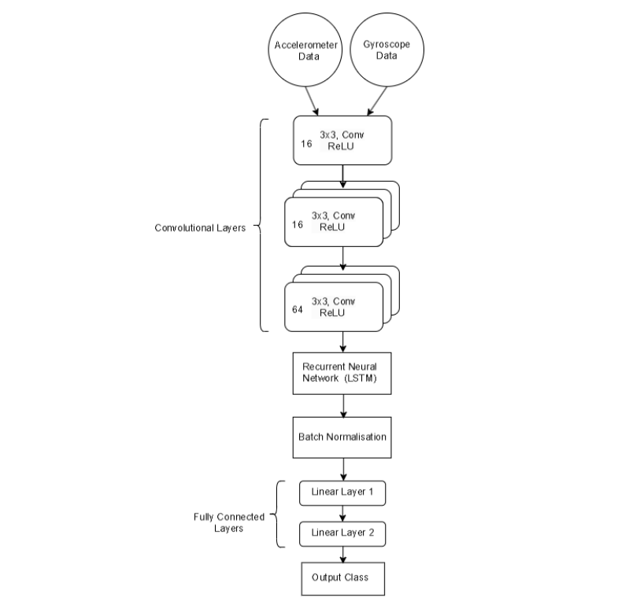

# Data Evaluation of 3-axis Acceleromter and 3-axis Gyroscope on vehicle door | Scenerio Classification using Artificial Intelligence

## Introduction
This project involves classifying scenarios using data from a 3-axis accelerometer and 3-axis gyroscope mounted on a vehicle door. A hybrid CNN-LSTM model is employed to effectively capture both spatial and temporal patterns in the sensor data for accurate scenario classification.

## Architecture

## Technology Used
1. Programming Language - Python
2. MATLAB
3. Hardware - 6-Axis Motion Sensor
4. Vector CANoe

## Dataset Used
The dataset includes scenarios involving various vehicle door and window operations, such as automatic and manual opening/closing, engine start/stop, block detection, and environmental interactions like ball hitting and finger impulses. It also covers unique conditions like passenger damping, music playing, and window lifter actions, offering a comprehensive range of motion and interaction patterns for classification.

